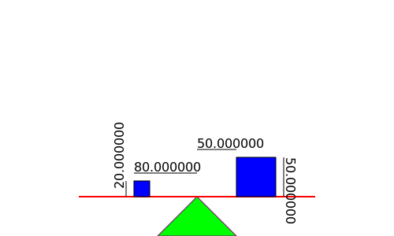

# HOMEWORK
## Device
The device I want to create is a 2D Lever with two square objects. 
**The parameters are:**
1.  The length of the shaft (or rod)
2.  The side's size of the two square objects
3.  The position of the two square objects from the middle of the shaft

For now the dimensions and the position of the triangle that supports the shaft are already given (are fixed).

